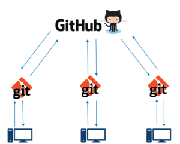

# GIT AND GITHUB PRACTICES

We are going to practice and settle down the concepts of Git and GitHub.

__1. What are the stages of git on local host__

Git has three main states that your files can reside in: modified, staged, and committed:

- Modified means that you have changed the file but have not committed it to your database yet.

- Staged means that you have marked a modified file in its current version to go into your next commit snapshot.

- Committed means that the data is safely stored in your local database.

__2. How can you reset/cancel if you have already run git add . command__

When using Git, it is quite common for developers to add new files to their repositories during development.

However, in some cases, you may want to undo a “git add” operation that you just performed.

The easiest way to undo your git add command is to use the “git restore” command with the “–staged” option and specify the file you want to unadd:

`git restore --staged <file>`

Or you can use:

`git reset`

without any file name to unstage all due changes.

__3. What is a git staging area__

Staging area is files that are going to be a part of the next commit, which lets git know what changes in the file are going to occur for the next commit.

Imagine a box. You can put stuff into the box. You can take stuff out of the box. This box is the staging area of Git.

__4. Workflow and the stages__

The three stages we have explained in the first point, this leads us to the three main sections of a Git project: the working tree, the staging area, and the Git directory.

- The working tree is a single checkout of one version of the project. These files are pulled out of the compressed database in the Git directory and placed on disk for you to use or modify.

- The staging area is a file, generally contained in your Git directory, that stores information about what will go into your next commit. Its technical name in Git parlance is the “index”, but the phrase “staging area” works just as well.

- The Git directory is where Git stores the metadata and object database for your project. This is the most important part of Git, and it is what is copied when you clone a repository from another computer.

The basic Git workflow goes something like this:

	1. You modify files in your working tree.

	2. You selectively stage just those changes you want to be part of your next commit, which adds only those changes to the staging area.

	3. You do a commit, which takes the files as they are in the staging area and stores that snapshot permanently to your Git directory.

If a particular version of a file is in the Git directory, it’s considered committed. If it has been modified and was added to the staging area, it is staged. And if it was changed since it was checked out but has not been staged, it is modified.

__5. Git merge and merge conflicts__

- Git Merge:

Merging is Git's way of putting a forked history back together again. The `git merge` command lets you take the independent lines of development created by git branch and integrate them into a single branch.

Git merge will combine multiple sequences of commits into one unified history. In the most frequent use cases, git merge is used to combine two branches.

`git merge` takes two commit pointers and will find a common base commit between them. Once Git finds a common base commit it will create a new "merge commit" that combines the changes of each queued merge commit sequence.

Say we have a new branch feature that is based off the master branch. We now want to merge this feature branch into master.

Invoking this command will merge the specified branch feature into the current branch, the master.

- Merge Conflicts:

Sometimes multiple developers may try to edit the same content. If Developer A tries to edit code that Developer B is editing a conflict may occur. To alleviate the occurrence of conflicts developers will work in separate isolated branches.

In Git, branches are a part of your everyday development process. Git branches are effectively a pointer to a snapshot of your changes.

When you want to add a new feature or fix a bug, you spawn a new branch to encapsulate your changes. This makes it harder for unstable code to get merged into the main code base, and it gives you the chance to clean up your future's history before merging it into the main branch.

The git merge command's primary responsibility is to combine separate branches and resolve any conflicting edits.

__6. Best practice to resolve git merge conflicts__

- How to resolve merge conflicts using the command line:

The most direct way to resolve a merge conflict is to edit the conflicted file. Open the merge.txt file in your favorite editor. For our example lets simply remove all the conflict dividers.

Once the file has been edited use git add merge.txt to stage the new merged content. To finalize the merge create a new commit.

Git will see that the conflict has been resolved and creates a new merge commit to finalize the merge.

- How to resolve a git merge conflict:

	1. Start with an empty directory and run git init.
	2. Now create a README file and commit the changes.
	3. Create a new branch.
	4. On the new branch, make an edit in the README, add a second line.
	5. Now commit.
	6. Return to the master branch, edit the README on line 3 with something different, and commit that.
	7. Merge the branch into master to see the error.
	8. Now, go into the README file, as Git asks, to see what it looks like. You will see that it has two blocks related with the two modifications, one of the branch that we created, and other from the master branch.
	9. As a developer, you decide what stays and what goes.
	10. Make your edits as necessary, then close the file. Decide what you want to keep or not.
	11. As you can see, this keeps the branch's edits. You can run git status to see further instructions.
	12. Notice that if you run into serious issues, you can abort the merge by running `git merge --abort` to abort the merge.
	13. Follow the directions to add the file and then commit.
	14. Done.

__7. Research around best practices of git and git-hub__

- Don’t git push straight to master: 

Regardless if you use Gitflow or any other git branching model, it is always a good idea to turn on git branch protection to prevent direct commits and ensure your main branch code is deployable at all times. All commits should be pushed to master through pull requests.

- Don’t commit code as an unrecognized author:

Sometimes you commit code using the wrong email address, and as a result GitHub shows that your commit has an unrecognized author. Having commits with unrecognized authors makes it more difficult to track who wrote which part of the code. Ensure your Git client is configured with the correct email address and linked to your GitHub user.

- Define code owners for faster code reviews:

When you’re dealing with dozens, hundreds, or more repositories and engineers, it’s nearly impossible to know who owns which parts of the codebase and need to review your changes. Even in smaller teams you’d still have code owners – for example, front-end code changes should be reviewed by the Front-End Engineer.

- Don’t commit dependencies into source control:

Pushing dependencies into your remote origin will increase repository size. Remove any projects dependencies included in your repositories and let your package manager download them in each build. 

- Don’t commit local config files into source control

Usually, those are private configuration files you don’t want to push to remote because they are holding secrets, personal preferences, history or general information that should stay only in your local environment.

__Example of workflow implemented in one project__

1. Fork the repo from the following address => `https://github.com/name/repository.git`.
2. Clone the forked repo to your local machine (use ssh address) => `git clone <url>`.
3. Add the main repo with an alias. By convention should be called `upstream` => `git remote add upstream git@github.com:name/repository.git`

You should have 4 configured remote repo 2 for your forked repo as `origin` and 2 for the main repo as `upstream`. Check by running => `git remote -v`,

4. If you create a feature branch remember to merge it into the main branch, before pushing it to github.
5. After you've completed your contribution you can push it to your forked repo

   1 `git add .`
   2 `git commit -m "comment"`
   3 `git push -u origin main`

6. Next go to the forked repo on your account and on the main page you'll find a button `New pull request`, use it to ask for your contribution to be accepted.
7. Lastly person responsible should accept the `pull request` and merge it with the main repo.
8. To have the latest update of the repo do a git pull from the main repo => `git pull upstream` (this command will overwrite the current repo with the updated one).

- The safe way would be to `git fetch upstream` first, and then `git merge upstream/main`.

__Git commands__

git config --local -l -> GETTING THE URL OF OUR REPOSITORY

git log -> to list all the commits that have been done with the number of the commit in the case that we would like to delete it

git log --oneline -> to list all the commmits in one line and to check where is the HEAD of the commits, what is the last commit

git branch -> check how many branch there are and also to see in what branch are you working

git status -> Displays paths that have differences between the index file and the current HEAD commit

git status -s -> resolve conflicts

git config --get remote.origin.url -> to get the url of the repository

git remote -v -> Manage the set of repositories ("remotes") whose branches you track. Be a little more verbose and show remote url after name

git remote add <original> git@github.com:name/repository.git -> Add a remote named <name> for the repository at <url>

git remote remove <original> -> Remove the remote named <name>. All remote-tracking branches and configuration settings for the remote are removed

git checkout <name_branch> -> to switch to another branch

git checkout -b <name_branch> -> create a new branch and switch to the new branch

git checkout <main> -> switch to branch main: To prepare for working on <branch>, switch to it by updating the index and the files in the working tree, and by pointing HEAD at the branch

git branch -M main -> With a -m or -M option, <oldbranch> will be renamed to <newbranch>. If <oldbranch> had a corresponding reflog, it is renamed to match <newbranch>, and a reflog entry is created to remember the branch renaming. If <newbranch> exists, -M must be used to force the rename to happen

git branch <name_branch> -> to create one branch

git branch -> to list all branches and see in what are you working

git branch -d <name_branch> -> to delete one branch

git reset HEAD~1 -> So, HEAD~1 means "go to the commit before the commit that HEAD currently points at"
So, HEAD~1 means "go to the commit before the commit that HEAD currently points at", while HEAD@{1} means "go to the commit that HEAD pointed at before it pointed at where it currently points at". That will easily allow you to find your lost commit and recover it. OR TO UNDO A COMMIT.

git reset --hard HEAD^ -> In order to hard reset to the commit right before HEAD, use “git reset” with the “–hard” option and specify HEAD^

The last two are the same.

git reset --hard <commit-number> -> "move" your HEAD back to the desired commit

https://desarrolloweb.com/articulos/descartar-cambios-archivos-git.html#:~:text=Para%20ello%20puedes%20usar%20el,que%20vuelva%20al%20estado%20anterior.&text=Este%20comando%20dejar%C3%A1%20el%20resto,%C3%BAnicamente%20del%20archivo%20que%20necesitabas.

https://stackoverflow.com/questions/5473/how-can-i-undo-git-reset-hard-head1

git reset --hard -> Discard all changes to modified files in the last commit

https://stackoverflow.com/questions/34519665/how-can-i-move-head-back-to-a-previous-location-detached-head-undo-commits/34519716#34519716

https://stackoverflow.com/questions/4114095/how-do-i-revert-a-git-repository-to-a-previous-commit

https://devconnected.com/how-to-git-reset-to-head/#:~:text=The%20purpose%20of%20the%20%E2%80%9Cgit,and%20of%20the%20working%20directory.

To delete one or more commits: https://jonsegador.com/2015/06/borrar-commits-de-git-reset-rebase-cherry-pick/#:~:text=En%20estos%20casos%20tenemos%20dos,permitir%C3%A1%20borrar%20commits%20no%20consecutivos.

git reflog -> to see all the resets you have done. All the differents HEAD you were going

https://stackoverflow.com/questions/97875/rm-rf-equivalent-for-windows

rm -rf .git -> to remove all related to the repository, to undo the git init
in windowds: rd -r ".git"

http://git-scm.com/docs/git-rm

https://www.atlassian.com/es/git/tutorials/undoing-changes -> to sum all the types of reset/revert/clean/checkout etc

fork:
https://www.youtube.com/watch?v=HbSjyU2vf6Y&ab_channel=TheNetNinja

branch and merge:
https://www.youtube.com/watch?v=tFr0Vg1q9Eg&ab_channel=Bluuweb%21

origin -> is the name you gave in the address

git merge <name_branch> -> we need to be in the branch that we want to merge and then specify with branch we want to add

git fetch <name_branch> -> it's the command that tells your local git to retrieve the latest metadata information from the original (although it doesn't do any file transfers. It's more like checking if there are any changes available).

git diff main upstream/main -> if something doesn't work let's see what is happening. To see the differences or conflicts
